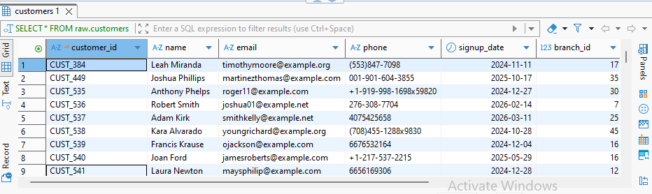
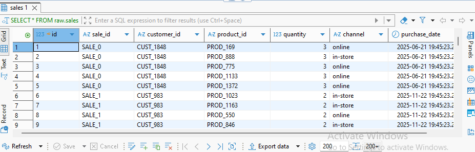
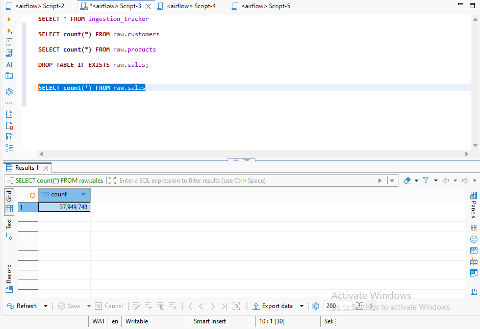
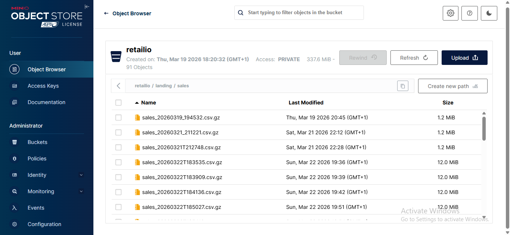
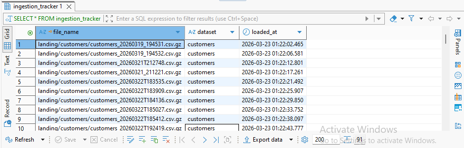
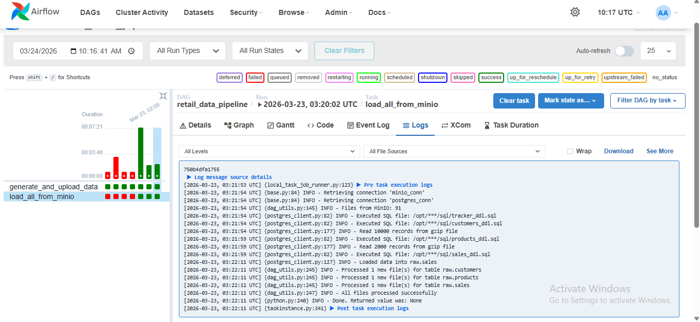

# retailio-end-to-end-data-pipeline
End-to-end data pipeline that generates synthetic retail datasets (customers, products and sales), stores the data in MinIO, and loads it into PostgreSQL in structured format using Python-based ETL workflows.

## Introduction
Retailio is a retail business that faces manual workflows, which introduce delays, errors, and inconsistencies across datasets. The project generates synthetic retail data—including customers, products, and sales—using Python which is stored in MinIO, then processed and loaded into PostgreSQL using a custom Python-based ETL pipeline, where it is structured into analytics-ready tables.

The goal of Retailio is to showcase how data moves from generation to storage and finally into a structured database for analysis—providing a practical, end-to-end view of a typical data engineering workflow.

## Problem Statement
The following are the challenges the business faces:
* Manual data handling processes leading to delays in data availability
* High risk of errors and inconsistencies across datasets
* Lack of a centralized system for storing and managing retail data
* Difficulty in transforming raw data into structured, analytics-ready formats
* Limited visibility into business performance due to unstructured data
* Absence of an automated pipeline for efficient data ingestion and processing
* Inability to simulate real-world retail data workflows for testing and learning

## Skills and Concepts demonstratedData pipeline design (end-to-end ETL workflow)
* Synthetic data generation using Python (Faker)
* Batch data ingestion and processing
* Python-based ETL development
* Handling large-scale datasets (millions of rows, including 37M+ records in sales data)
* Logging and monitoring within data pipelines
* Error handling and debugging in distributed workflows
* Understanding of data consistency and data integrity
* Modular code design and reusable components
* Basic orchestration concepts (Airflow exposure, even if later removed)
* Real-world simulation of retail datasets (customers, products, sales)

## Tech Stack
* Object Storage (Data Lake): MinIO 
* Database (Data Warehouse): PostgreSQL
* Containerization: Docker & Docker Compose
* Orchestration (initial exposure): Apache Airflow

## Data Pipeline Workflow
There are 2 tasks in the pipeline:
* Generate_and_upload_all Task
  
This generates synthetic retail datasets (customers, products, sales) using Python and Faker. It converts the data into CSV files and compresses them as .csv.gz. Then uploads these files to MinIO (object storage), acting as the raw data layer (data lake) which ensures data is ready and available for downstream processing.

Customer Data

* Load_all_from_minio Task

It reads the compressed CSV files from MinIO, processes and transforms the raw data to match the PostgreSQL table schemas. It checks the tracker table before processing each file, then process only new files not yet recorded in the tracker and insert a record into the tracker after successful processing.
It Loads data into PostgreSQL using efficient insert and upsert strategies for fact and dimension tables respectively. Also handles large volumes of data (millions of rows) while maintaining data consistency and integrity.

Sales Table

* Sales Record Count

## Pipeline Components
1. Data Generation Layer
It uses Python (Faker library) to generate synthetic datasets: customers, products, sales and ensures data resembles real-world retail scenarios

2. Landing Storage Layer
MinIO (S3-compatible object storage) is used to store raw .csv.gz files which acts as a data lake for storage before transformation

Minio

4. Data Warehouse Layer
PostgreSQL is used to store analytics-ready tables: customers, products and sales

5. Pipeline Orchestration & Workflow Management
Apache Airflow orchestrates tasks such as generate_and_upload_all and load_all_from_minio, manages dependencies, scheduling, and logging

6. Ingestion Tracker Table
Checks the tracker table before processing each file. Process only new files not yet recorded in the tracker. Insert a record into the tracker after successful processing.

* Tracker Table

5. Monitoring & Logging
Python logging module is used to track files processed, rows loaded, and errors during ETL which helps in debugging and ensuring pipeline reliability

* Log

7. Configuration & Modular Components
Python modules and reusable functions are used to provide abstraction for MinIO client, PostgreSQL client, and ETL operations which allows easy updates and scalability

* Project Structure

## Project Summary
This project simulates a real-world retail business workflow that generates synthetic retail datasets—including customers, products, and sales—using Python, and stores the raw data in MinIO, an S3-compatible object storage, acting as a data lake.

Data were read from MinIO, process and transform into match PostgreSQL schemas, and loads into analytics-ready tables. The pipeline includes a tracker table to prevent reprocessing of already ingested files, ensuring efficient and incremental data loading.

This project demonstrates skills in large-scale data handling (millions of rows), data pipeline design, object storage, ETL development, database design, and workflow monitoring. It provides a practical example of how raw retail data can be transformed into structured, consistent, and query-ready datasets for business analytics.

## Thank you for reading!
